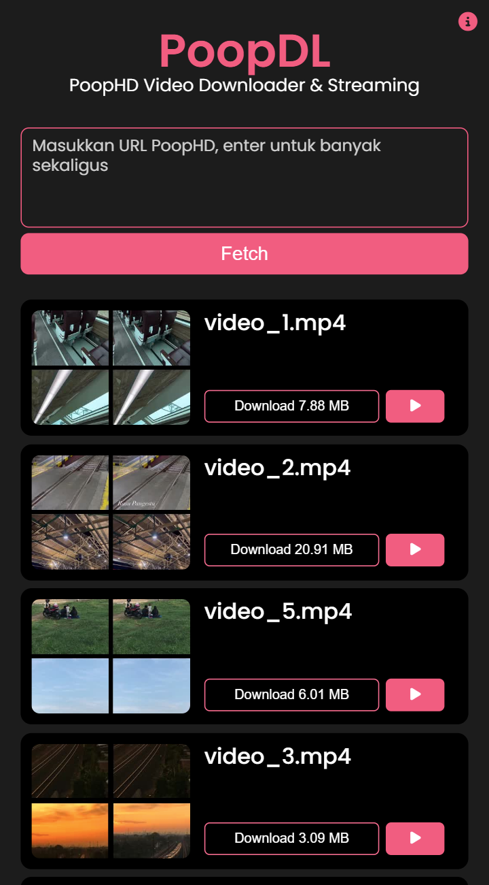
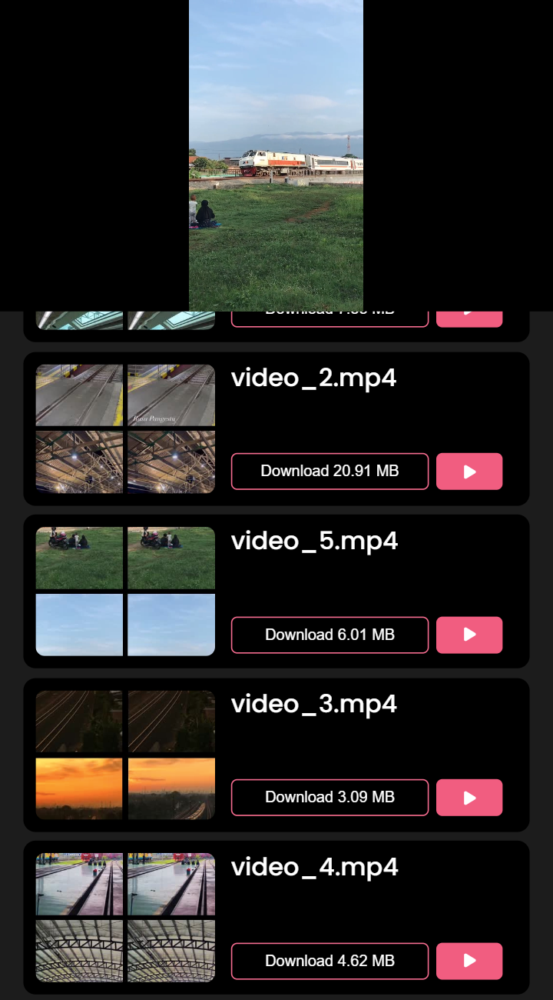
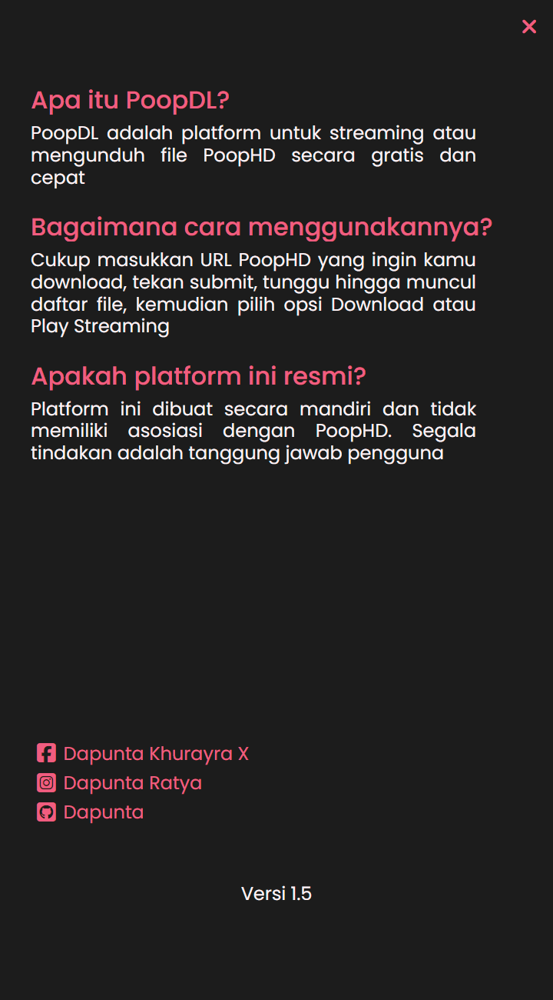

## PoopDL - PoopHD Video Downloader & Streaming

<b>PoopDL</b> adalah platform untuk streaming atau mengunduh video PoopHD secara gratis dan cepat, yang diciptakan untuk mempermudah unduhan & streaming

 

    
    
    
    

### Informasi

<table style="border-collapse: collapse;">
    <tr>
        <td style="border: 1px solid transparent; line-height:1.3; padding: 0px;">Version</td>
        <td style="border: 1px solid transparent; line-height:1.3; padding: 0px;">1.5</td>
    </tr>
    <tr>
        <td style="border: 1px solid transparent; line-height:1.3; padding: 0px;">Website</td>
        <td style="border: 1px solid transparent; line-height:1.3; padding: 0px;"><a href="https://poopdl.dapuntaratya.com">PoopDL</a></td>
    </tr>
    <tr>
        <td style="border: 1px solid transparent; line-height:1.3; padding: 0px;">API</td>
        <td style="border: 1px solid transparent; line-height:1.3; padding: 0px;"><a href="https://poopdl-api.dapuntaratya.com">PoopDL API</a></td>
    </tr>
    <tr>
        <td style="border: 1px solid transparent; line-height:1.3; padding: 0px;">API Doc</td>
        <td style="border: 1px solid transparent; line-height:1.3; padding: 0px;"><a href="/api/">Documentation</a></td>
    </tr>
    <tr>
        <td style="border: 1px solid transparent; line-height:1.3; padding: 0px;">Author</td>
        <td style="border: 1px solid transparent; line-height:1.3; padding: 0px;"><a href="https://www.facebook.com/Dapunta.Khurayra.X">Dapunta Khurayra X</a></td>
    </tr>
    <tr>
        <td style="border: 1px solid transparent; line-height:1.3; padding: 0px;">Status</td>
        <td style="border: 1px solid transparent; line-height:1.3; padding: 0px;">Open Source (Full)</td>
    </tr>
</table>

### Screenshot

<table style="border-collapse: collapse; width: 100%; max-width: 800px; table-layout: fixed;">
    <tr>
        <td style="border: 1px solid transparent; padding: 5px; text-align: center;">
            
        </td>
        <td style="border: 1px solid transparent; padding: 5px; text-align: center;">
            
        </td>
        <td style="border: 1px solid transparent; padding: 5px; text-align: center;">
            
        </td>
    </tr>
</table>

### TechStack

<table style="border-collapse: collapse;">
    <tr>
        <td style="border: 1px solid transparent; line-height:1.3; padding: 0px;">Backend</td>
        <td style="border: 1px solid transparent; line-height:1.3; padding: 0px;">Python (Flask)</td>
    </tr>
    <tr>
        <td style="border: 1px solid transparent; line-height:1.3; padding: 0px;">Frontend</td>
        <td style="border: 1px solid transparent; line-height:1.3; padding: 0px;">HTML, CSS (VanillaCSS), Javascript (VanillaJS)</td>
    </tr>
</table>

 

### Changelog

 

- **Apa Yang Baru Di Versi 1.5?**

    - Perbaikan get url download & stream
    - Optimasi UI *(layout stream, scrollbox, etc.)*

- **Apa Yang Baru Di Versi 1.0?**

    - First deploy [PoopDL](https://poopdl.dapuntaratya.com/)
    - Fitur :
        - `Fetch` : Scrap data video *(bisa banyak url sekaligus)*
        - `Download` : Mengunduh video *(fast download)*
        - `Stream` : Streaming video lancar *(tanpa iklan)*

 

### Cara Penggunaan API

- Link : [API Documentation](/api/)

 

### Other

> [!TIP]  
> Jika ingin menjalankan di local, pastikan `flask_app.py` sudah di-run  
> Lalu jalankan *live-server* atau *localhost* pada `index.html`

> [!WARNING]  
> Platform ini hanya dapat berfungsi untuk URL PoopStream  
> Contoh : `poop.vin`, `poop.direct`, `poopstream.com`, dan lainnya

> [!CAUTION]  
> Platform ini tidak berfungsi untuk Doodstream  
> Segala tindakan adalah tanggung jawab pengguna